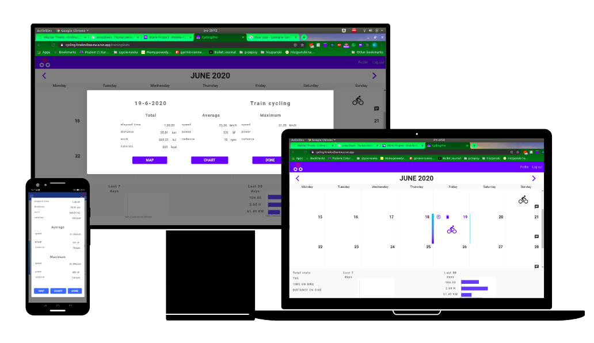
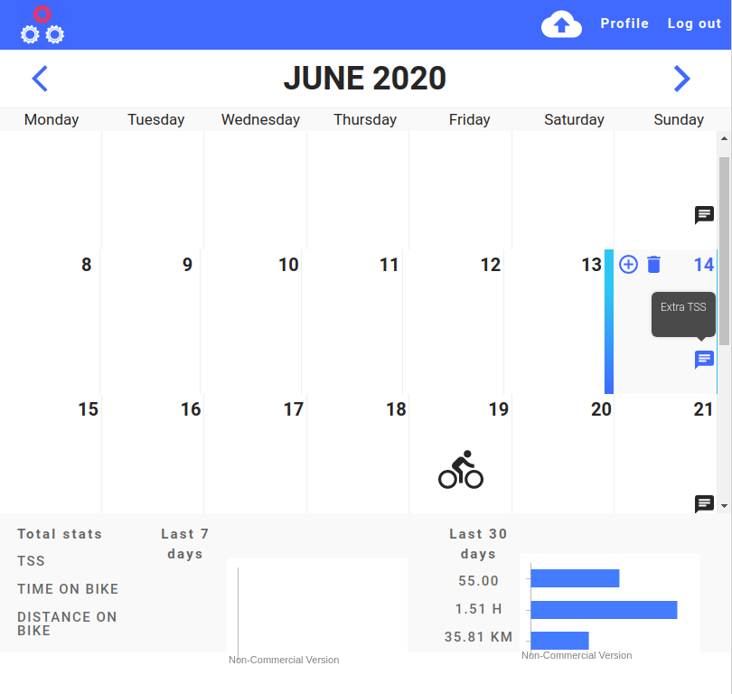
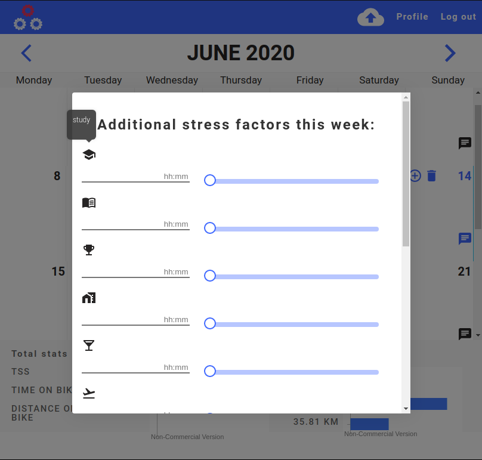
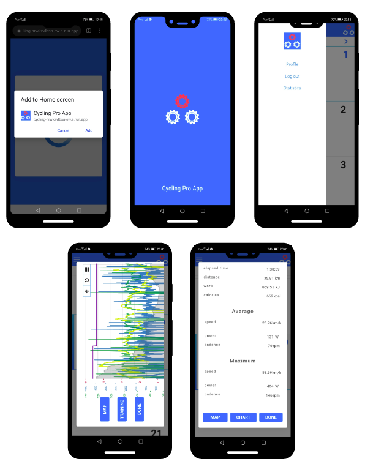
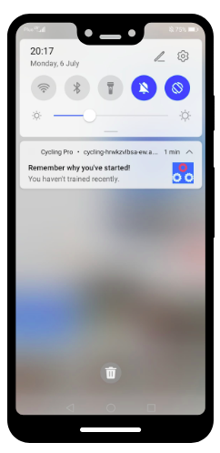
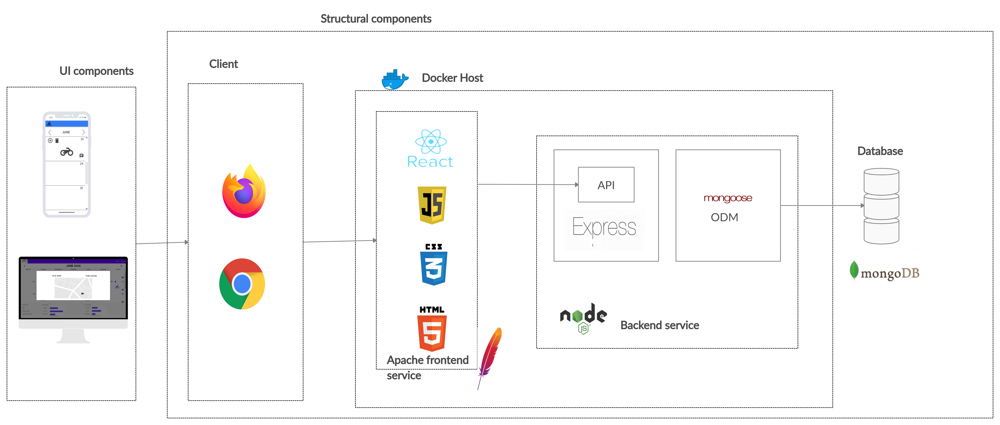
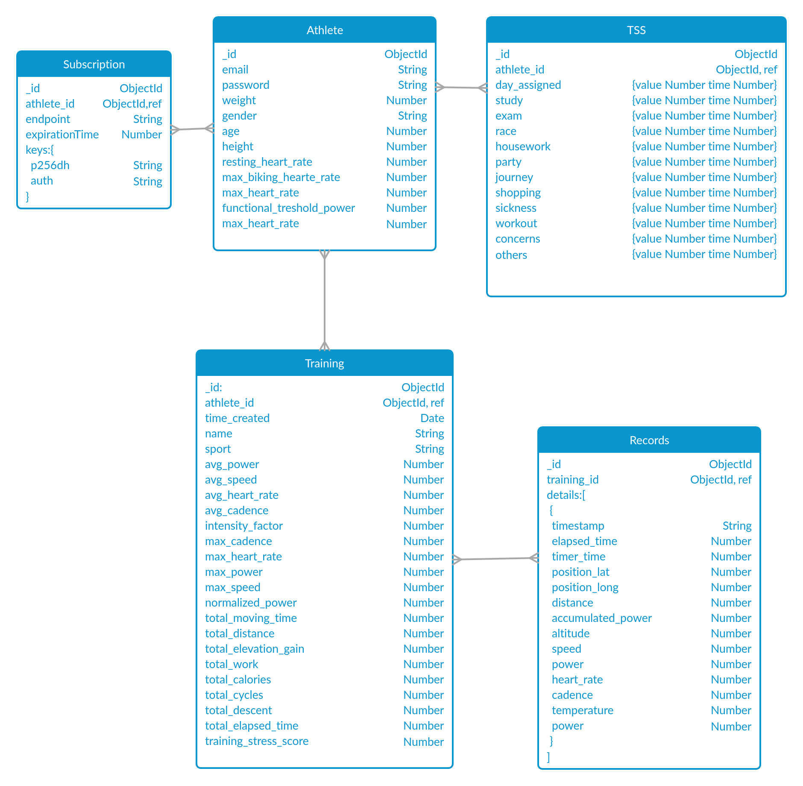
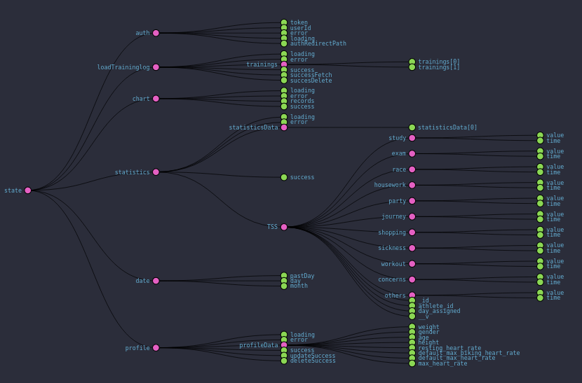

# Master Thesis: UI/UX design for sport's platforms

## Description

Nowadays there is high demand for fitness app, but those who are
delivered by the sport vendors are not very efficient and user friendly.
The main aim of the project is to provide web application with better UX/UI
than available in the current market of sports devices applications.
On the basis of contacted survey amog 50 professional cyclists the requirements for the project were defined, implemented and tested by the users.

## Perview of the application

### Desktop version

### Mobile version

## Functionality

Core functionalities of the application:

- create an account,
- delete the own account,
- upload training from Garmin device,
- delete training,
- view the data from training,
- create chart from training data,
- view the map from training data,
- display statistics from week,
- display statistics from month,
- add metrics to the profile,
- edit metrics of the profile,
- remove metrics of the profile,
- add additional stress factors to the plan,
- edit additional stress factor in the plan,
- delete additional stress factor from the plan,
- send push notification, while the particular value of TSS is reached,
- send push notification, while the last training was uploaded 3 days ago,
- the shortcut of the application on the screen,
- the application is avaliable on the phone,
- the application is avaliable in the browser.

## Architecture of the application

The schema of the entire structure of the application is in the picture below. Front-end is created in React JS library with just one HTML file and many JS and CSS files due to module approach. Static files are host on WWW Apache server. Back-end is built in Node.js, all requests are handled by the Express API and database objects are accessed using the mongoose ODM library. The data is stored in a non-relational database–mongoDB. Front-end and server are containerized in the Docker host. Nevertheless, database is established outside the Docker host. Since the current methods of establishing database in the container are unreliable and unstable for production build. When the Docker image of database is not in use it would be closed down as well as all data in it. To provide continuous work of the database in the container, it would be necessary to use Kubernetes orchestration system.

## DB structure

## States of the app handled by Redux

